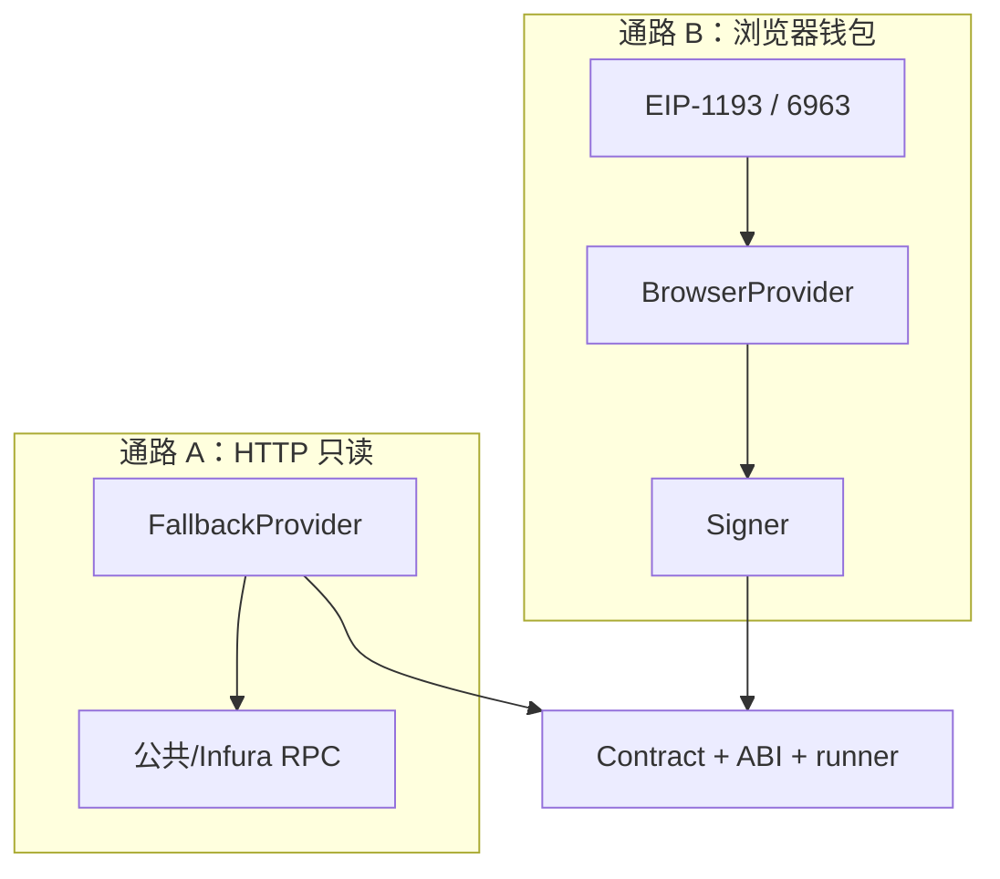

# MetaNode Stake 前端（stake-fe）架构与代码导读

> **文件路径**：`stake-fe/docs/前端架构与代码导读.md`  
> **配套**：`src/` 里很多文件已有**中文块注释**，和本文一起读效果最好。

---

## 这篇文档适合谁？怎么用？

- 适合：**刚接触 DApp / React / Next.js** 的同学，想**按顺序**读懂本仓库前端在干什么。  
- **建议用法**：从下文的「第 0 步」开始，**一天读几步**即可，不必一次读完。每一步都写了「读完你应该能回答什么」——答不上就回到对应源码再看一眼。  
- **样式与工程配置**：**第 13、14 步**讲 `globals.css`、`tailwind.config.js`、`public/`、`next.config.js` 等（在「`src` 目录地图」和「仓库根目录」之后）。  
- **不要做的事**：第一次读不要去抠 `stake.ts` ABI 里几千行 JSON，只需知道「ABI 是合约接口说明书」即可。

---

## 第 0 步：先搞懂几个词（不懂这些后面会晕）

| 词 | 傻瓜理解 | 在本项目里 |
|----|----------|------------|
| **区块链 / 测试网 Sepolia** | 一条公开的账本；Sepolia 是以太坊的**测试**链，币不值真钱。 | 合约部署在 Sepolia，`chainId` 在 [`config/chain.ts`](../src/config/chain.ts)。 |
| **钱包（MetaMask 等）** | 帮你**保管地址**、对交易**点确认**的浏览器扩展。 | 通过 **EIP-1193**（`provider.request`）和页面通信。 |
| **RPC 节点** | 一台帮你「读账本」的服务器（HTTP）。 | **通路 A**：[`ethersReadProvider.ts`](../src/utils/ethersReadProvider.ts)，不经过钱包也能读部分数据。 |
| **Provider（ethers）** | 能向链发「只读请求」的对象（查余额、调 view 函数）。 | `readProvider` + 钱包外的 `BrowserProvider`。 |
| **Signer** | 能**签名交易**的对象（发质押、领取等必须用它）。 | 用户连接钱包后 `BrowserProvider.getSigner()`。 |
| **ABI** | 合约有哪些函数、参数类型的**清单**（像 API 文档）。 | [`assets/abis/stake.ts`](../src/assets/abis/stake.ts)（文件很大，头注释说明即可）。 |
| **Contract（ethers）** | 用「地址 + ABI + runner」封装好的合约对象，可 `.depositETH()` 这样调。 | [`contractHelper.ts`](../src/utils/contractHelper.ts) + [`useContract.ts`](../src/hooks/useContract.ts)。 |
| **view / 写交易** | view：只读，不改链上状态；写：要打包进区块，**消耗 gas**。 | 读用 `readProvider` 即可；写必须 `connectWithSigner` 再调。 |

**一句话记本项目**：  
**通路 A（HTTP）**负责「尽量不让页面瞎」；**通路 B（钱包）**负责「用户授权 + 签名发交易」。两件事**不要混成一件事**（尤其排查报错时）。

---

## 第 1 步：从浏览器打开页面开始，代码从哪跑起来？

### 1.1 读哪个文件？

[`src/pages/_app.tsx`](../src/pages/_app.tsx)

### 1.2 它在干什么？

Next.js **每一个页面**渲染前，都会先经过 `_app.tsx`。这里像「总开关」：

1. 套 **MUI 主题**（`ThemeProvider`）  
2. 套 **Web3Provider**（整站共享钱包状态 + `readProvider`）  
3. 套 **Toast**（操作成功/失败的小条提示）  
4. 套 **Layout**（顶栏 + 页脚 + 中间放「当前页面」）

### 1.3 为什么要这样写？

- **避免每个页面自己包一层 Provider**：改一次 `_app` 全站生效。  
- **Web3Provider 必须在 Layout 外面**：这样 `Header` 里也能 `useWeb3()`。

### 1.4 读完这一步你应该能说什么？

「用户打开任意 URL，都会先挂上 Web3 和布局，再渲染具体页面。」

---

## 第 2 步：URL 和文件怎么对应？（路由）

### 2.1 读哪些文件？

| 浏览器地址 | 入口文件 | 说明 |
|------------|----------|------|
| `/` | [`pages/index.tsx`](../src/pages/index.tsx) | 很薄，只 `import Home from './home/page'` |
| `/` 真正 UI | [`pages/home/page.tsx`](../src/pages/home/page.tsx) | 质押首页（大文件） |
| `/withdraw` | [`pages/withdraw/index.tsx`](../src/pages/withdraw/index.tsx) | 提现/解押页 |
| `/claim` | [`pages/claim/index.tsx`](../src/pages/claim/index.tsx) | 领取页 |

### 2.2 为什么要 `index.tsx` 再转一层 `home/page`？

`index.tsx` 里注释写得很清楚：**路由入口保持干净**，大块业务都放在 `home/page.tsx`，以后换首页结构不必动路由文件。

### 2.3 读完这一步你应该能说什么？

「改首页业务主要改 `home/page.tsx`；改 `/withdraw` 改 `withdraw/index.tsx`。」

---

## 第 3 步：整站「壳」长什么样？（Layout + Header）

### 3.1 读哪个文件？

[`src/components/Layout.tsx`](../src/components/Layout.tsx)  
再读 [`src/components/Header.tsx`](../src/components/Header.tsx)

### 3.2 原理是啥？

- **Layout**：`children` 就是「当前路由页面」。背景、动效用 `fixed` + `pointer-events-none`，避免挡住按钮点击。  
- **Header**：导航链接 + **连接 / 断开 / 切 Sepolia**（调用 `useWeb3()` 里的方法）。

### 3.3 为什么要这样写？

所有页面共用同一顶栏，用户从「质押」跳到「提现」不会丢连接状态（状态在 `Web3Provider` 里，不在 Header 里）。

### 3.4 读完这一步你应该能说什么？

「顶栏的「连接」和页面里的「连接钱包」调的是**同一个** `connect()`。」

---

## 第 4 步：全站最重要的文件——Web3Provider（必读、可多读几遍）

### 4.1 读哪个文件？

[`src/providers/Web3Provider.tsx`](../src/providers/Web3Provider.tsx)

### 4.2 它在干什么？（用大白话）

1. 创建**只读**的 `readProvider`（HTTP，多节点容错）。  
2. 用户点连接时：找浏览器钱包 → 可能要**弹窗选多个钱包里的哪一个** → `eth_requestAccounts` → 不在 Sepolia 就 `wallet_switchEthereumChain`。  
3. 把 `address`、`chainId`、`signer`、`error` 放进 **React Context**，任何子组件 `useWeb3()` 都能读。  
4. 监听 `accountsChanged` / `chainChanged`，和用户钱包保持同步。

### 4.3 为什么要 `staticNetwork` + 又单独 `readWalletChainId`？

- **原因**：ethers 对浏览器钱包默认会反复探测网络，扩展一异常就**控制台狂刷**；我们业务固定 Sepolia，所以用 `staticNetwork`「关掉」这层探测。  
- **但**：UI 要知道用户**真实**在哪条链（要不要显示「切到 Sepolia」），所以必须再**直接**问钱包 `eth_chainId`（[`readWalletChainId`](../src/utils/injectedProvider.ts)）。

### 4.4 读完这一步你应该能说什么？

「`isConnected` 是「有地址且链 ID 是 Sepolia」；`needsNetworkSwitch` 是「有地址但链不对」。」

---

## 第 5 步：钱包是怎么「找」到的？（injectedProvider）

### 5.1 读哪个文件？

[`src/utils/injectedProvider.ts`](../src/utils/injectedProvider.ts)

### 5.2 原理是啥？

- **`window.ethereum`**：老办法，只有一个全局对象，**多扩展会抢**。  
- **EIP-6963**：每个钱包可以「自报家门」，页面能拿到**多个**独立 `provider`，让用户选（[`WalletPickerModal`](../src/components/WalletPickerModal.tsx)）。  
- **`getConnectWalletCandidates`**：连接按钮用，**两轮**短时间监听，怕电脑慢时 MetaMask 报晚。  
- **`resolveEthereumProvider`**：刷新页面**静默恢复**用，要轻量，**不搞两轮**，避免拖慢首屏。

### 5.3 为什么要分两个函数？

**体验与性能折中**：点连接可以慢一点换「列表完整」；刷新进首页要快。

### 5.4 读完这一步你应该能说什么？

「多钱包时不是改 RPC，而是选对 **EIP-1193 provider**。」

---

## 第 6 步：HTTP 只读通路（ethersReadProvider）

### 6.1 读哪个文件？

[`src/utils/ethersReadProvider.ts`](../src/utils/ethersReadProvider.ts)

### 6.2 原理是啥？

- 页面用 `readProvider.call` / `getBalance` 等，本质是向 **HTTPS RPC** 发 JSON。  
- **`FallbackProvider`**：一个节点挂了换另一个。  
- **`staticNetwork`**：避免 ethers 对坏节点无限「探测链 ID」刷日志（见文件头注释）。

### 6.3 为什么要这条通路？

让用户**还没连钱包**时，也能尝试读**公开**合约数据（具体哪些能读取决于合约是否允许匿名读）。

### 6.4 读完这一步你应该能说什么？

「连接失败别先怀疑这个文件；**读数据失败**才优先查 RPC / 网络。」

---

## 第 7 步：连接报错为啥不是满屏英文？（formatWalletConnectError）

### 7.1 读哪个文件？

[`src/utils/formatWalletConnectError.ts`](../src/utils/formatWalletConnectError.ts)

### 7.2 原理是啥？

钱包和 ethers 抛错经常是一层包一层，`e.message` 很长。这里**递归扒** `code` 和字符串，映射成**短中文**，并单独提醒**多扩展冲突**（因为和「没账户」很像）。

### 7.3 读完这一步你应该能说什么？

「这是**通路 B** 专用；HTTP 读链报错不走这套文案。」

---

## 第 8 步：页面上谁负责「点连接」？（WalletConnectPrompt + 文案）

### 8.1 读哪些文件？

[`src/components/WalletConnectPrompt.tsx`](../src/components/WalletConnectPrompt.tsx)  
[`src/utils/walletUiCopy.ts`](../src/utils/walletUiCopy.ts)  
[`src/components/WalletPickerModal.tsx`](../src/components/WalletPickerModal.tsx)

### 8.2 原理是啥？

- **Prompt**：根据 `needsNetworkSwitch` 显示「切 Sepolia」或「连接钱包」。  
- **walletUiCopy**：环境提示集中存放，避免多处复制粘贴。  
- **Modal**：候选钱包 **>1** 时出现，用户点选后再走 `connectWithProvider`。

### 8.3 读完这一步你应该能说什么？

「Header 和页面内按钮都调用同一个 `connect()`，Modal 由 Web3Provider 渲染在树里。」

---

## 第 9 步：合约实例从哪来？（useContract → contractHelper → connectWithSigner）

### 9.1 读哪些文件？

[`src/hooks/useContract.ts`](../src/hooks/useContract.ts)  
[`src/utils/contractHelper.ts`](../src/utils/contractHelper.ts)  
[`src/utils/connectWithSigner.ts`](../src/utils/connectWithSigner.ts)  
[`src/utils/env.ts`](../src/utils/env.ts)

### 9.2 原理是啥？

- **地址**：从 `NEXT_PUBLIC_STAKE_ADDRESS` 来（[`env.ts`](../src/utils/env.ts)），没配会是 `ZeroAddress`，怎么调都失败。  
- **runner**：`signer ?? readProvider` —— 没钱包时用 HTTP 只读；有钱包时用 Signer（可读可签）。  
- **写交易**：必须 `connectWithSigner(contract, signer)`，因为 TypeScript 要知道「现在是 Signer 在跑」。

### 9.3 为什么要 `connectWithSigner` 这一层？

ethers v6 的 `contract.connect` 返回类型太宽，项目里用 `as Contract` **收窄**，你写 `stakeWithSigner.depositETH` 时 IDE 还能提示方法名。

### 9.4 读完这一步你应该能说什么？

「只读可以不要 Signer；**改状态**一定要 Signer + `connectWithSigner`。」

---

## 第 10 步：业务数据怎么从链上拉到 React？（Hooks）

### 10.1 读哪些文件？

[`src/hooks/useRewards.ts`](../src/hooks/useRewards.ts)  
[`src/hooks/useWalletBalance.ts`](../src/hooks/useWalletBalance.ts)

### 10.2 原理是啥？

- **useRewards**：调质押合约的 `pool`、`user` 等 **view**，用 `formatUnits` 变成人类可读字符串；里面用 [`retry.ts`](../src/utils/retry.ts) **重试** RPC 抖动。  
- **useWalletBalance**：ETH 用 `readProvider.getBalance`；ERC20 用最小 ABI 建临时 `Contract` 调 `balanceOf` / `decimals`；定时 **10 秒**刷新一次。

### 10.3 为什么要 retry？

公共 RPC 偶尔会 **429 限流** 或超时，重试几次比直接白屏友好（见 `retry.ts` 注释）。

### 10.4 读完这一步你应该能说什么？

「Hooks = 把链上异步数据变成 `useState` + `useEffect`，页面只负责展示和按钮。」

---

## 第 11 步：三个页面分别在干嘛？（业务入口）

### 11.1 读哪些文件？

[`src/pages/home/page.tsx`](../src/pages/home/page.tsx) — 质押 + 部分领取交互  
[`src/pages/withdraw/index.tsx`](../src/pages/withdraw/index.tsx) — 解押 / 提现流程  
[`src/pages/claim/index.tsx`](../src/pages/claim/index.tsx) — 领取奖励  

### 11.2 通用模式（你看任何一页都能套）

1. `useWeb3()` 拿 `address`、`signer`、`isConnected`  
2. `useStakeContract()` / `useTokenContract()` 拿合约  
3. 读数据：直接 `contract.xxx()` 或走自定义 hook  
4. 写数据：`try { setLoading(true); const tx = await ...; await tx.wait(); toast.success } finally { setLoading(false) }`

### 11.3 为什么要 `tx.wait()`？

发交易只代表「提交到链上」，**打包进块**才算成功；`wait()` 就是等这个结果。

### 11.4 读完这一步你应该能说什么？

「页面是「拼 UI + 调 hook + 发交易」；复杂逻辑尽量下沉到 hook/utils。」

---

## 第 12 步：小工具与类型（遇到再查）

| 文件 | 干什么 | 为啥存在 |
|------|--------|----------|
| [`utils/cn.ts`](../src/utils/cn.ts) | 合并 Tailwind 类名 | 条件样式不写一串字符串拼接 |
| [`utils/index.ts`](../src/utils/index.ts) | 导出 `Pid`（池子 ID = 0） | 合约多池时用；本项目写死 0 |
| [`utils/metamask.ts`](../src/utils/metamask.ts) | `wallet_watchAsset` 加代币图标 | 可选体验，不是连接主流程 |
| [`utils/theme.ts`](../src/utils/theme.ts) | MUI 主题 | `_app` 里用 |
| [`types/global.d.ts`](../src/types/global.d.ts) | 告诉 TS `window.ethereum` 形状 | 否则 `window.ethereum` 报错 |
| [`components/ui/Button.tsx`](../src/components/ui/Button.tsx) 等 | 通用 UI | 全站统一样式与 loading |
| [`config/chain.ts`](../src/config/chain.ts) | Sepolia 的 chainId / 十六进制 | 切链、比对网络用 |

读完 `src` 目录地图后，继续 **第 13、14 步**（全局样式、`public`、Next/Tailwind/PostCSS 配置），位置在「仓库根目录」小节之后。

---

## `src` 目录地图（全前端源码一览）

```
src/
├── pages/
│   ├── _app.tsx              # 全局壳：主题 + Web3 + Toast + Layout
│   ├── index.tsx             # 路由 "/" → 转 home/page
│   ├── home/page.tsx         # 首页：质押主流程
│   ├── withdraw/index.tsx    # 提现/解押页
│   └── claim/index.tsx       # 领取页
├── providers/
│   └── Web3Provider.tsx      # ethers 连接 + Context + 多钱包弹窗
├── components/
│   ├── Layout.tsx            # 布局 + 背景
│   ├── Header.tsx            # 导航 + 顶栏连接
│   ├── WalletConnectPrompt.tsx
│   ├── WalletPickerModal.tsx
│   └── ui/                   # Button, Card, Input…
├── hooks/
│   ├── useContract.ts        # 质押/ERC20 合约实例
│   ├── useRewards.ts         # 池子与用户奖励数据
│   └── useWalletBalance.ts   # ETH/ERC20 余额
├── utils/
│   ├── ethersReadProvider.ts # HTTP 只读 FallbackProvider
│   ├── injectedProvider.ts   # EIP-1193 / 6963
│   ├── formatWalletConnectError.ts
│   ├── walletUiCopy.ts
│   ├── contractHelper.ts     # new Contract(...)
│   ├── connectWithSigner.ts
│   ├── env.ts                # 合约地址环境变量
│   ├── index.ts              # Pid
│   ├── retry.ts              # RPC 重试
│   ├── metamask.ts           # 添加代币到钱包
│   ├── cn.ts                 # 类名工具
│   └── theme.ts              # MUI theme
├── config/
│   └── chain.ts              # Sepolia 常量
├── assets/abis/
│   └── stake.ts              # 质押合约 ABI（大文件，读头注释即可）
└── types/
    └── global.d.ts           # window.ethereum 类型
```

### 仓库根目录（和 `src` 并列的配置与静态资源）

```
stake-fe/
├── package.json          # 依赖与脚本：dev / build / start
├── next.config.js        # Next.js 行为（本仓库较简）
├── tsconfig.json         # TypeScript 编译选项
├── tailwind.config.js    # Tailwind：扫描哪些文件、主题色 primary
├── postcss.config.js     # PostCSS：接 tailwind + autoprefixer
├── next-env.d.ts         # Next 生成的类型声明（一般不改）
├── public/               # 静态资源根：URL 以 / 开头直链（见下）
└── src/
    └── styles/           # 全局 CSS（见第 13 步）
```

---

## 第 13 步：样式与静态资源（`styles` / `public`）

### 13.1 读哪些文件？

| 路径 | 作用 |
|------|------|
| [`src/styles/globals.css`](../src/styles/globals.css) | **全局样式入口**：Tailwind 三层指令、`body` 背景、**组件类**（`.btn-primary`、`.card`、`.tech-grid` 等）、滚动条与动画 |
| [`src/styles/Home.module.css`](../src/styles/Home.module.css) | CSS Modules 示例文件；**当前项目页面未引用**，可忽略或将来按需使用 |
| [`public/`](../public/) | Next 约定：**放 favicon、图片等**；浏览器用 `https://域名/文件名` 访问 |

`_app.tsx` 里有一句 `import '../styles/globals.css'`，所以**全站**都会带上 `globals.css` 里的样式。

### 13.2 原理是啥？（Tailwind 在本项目怎么转起来）

1. 你在组件里写的 `className="btn-primary"`、`bg-gray-900` 等，一类是 **Tailwind 工具类**（由 `tailwind.config.js` 里 `content` 扫描到的类名生成 CSS），一类是 **`globals.css` 里自定义的 `@layer components`**（如 `.btn-primary`）。  
2. **构建链**：`PostCSS` 读 `postcss.config.js` → 跑 `tailwindcss` + `autoprefixer` → 输出最终 CSS。  
3. **`primary` 色阶**：在 [`tailwind.config.js`](../tailwind.config.js) 的 `theme.extend.colors.primary` 里定义，`btn-primary`、强调色都围绕这套蓝色。

### 13.3 为什么要单独写 `.btn-primary` 而不是全用行内 Tailwind？

- **复用**：按钮样式一致，改一处全局变。  
- **伪元素**：`globals.css` 里用 `::before` 做扫光，纯长串 `className` 不好维护。

### 13.4 `public` 里要放什么？

- `_app.tsx` 使用 `<link href="/favicon.ico" />`，对应文件应为 **`public/favicon.ico`**。若仓库里暂无 `public` 或文件缺失，浏览器会 404，**不影响**合约逻辑，只是图标不显示。  
- 以后若有 `public/images/logo.png`，页面里写 `` 即可（**不要**加 `public` 前缀）。

### 13.5 读完这一步你应该能说什么？

「全站样式从 `globals.css` 进；主题色在 `tailwind.config.js`；静态文件走 `public/`。」

---

## 第 14 步：Next 与工程配置（傻瓜版）

### 14.1 [`next.config.js`](../next.config.js)

- 当前几乎只有 **`reactStrictMode: true`**：开发态下 React **故意双重调用**部分生命周期/Effect，帮你提前发现副作用问题；控制台有时会「多打一次 log」，属正常现象。  
- 若以后要配图片域名、重写路由、环境变量白名单等，都写在这个文件。

### 14.2 [`package.json`](../package.json) 脚本

| 命令 | 含义 |
|------|------|
| `pnpm dev` / `npm run dev` | 本地开发，默认 `http://localhost:3000` |
| `pnpm build` | 生产构建 |
| `pnpm start` | 构建后启动生产服务 |

### 14.3 [`tsconfig.json`](../tsconfig.json)

- 告诉 TypeScript：严格模式、`jsx` 保留给 Next 编译、`include` 哪些文件。  
- **`target: es5`**：兼容较老浏览器；与 ethers/现代语法由打包工具处理。  
- 一般**不必**为学业务去改它。

### 14.4 Tailwind 的 `content` 路径要注意什么？

[`tailwind.config.js`](../tailwind.config.js) 里 `content` 列出了要扫描的目录。若你新建了页面在别的目录却**没有**出现在 `content` 里，那些文件里的 Tailwind 类可能**不会**进最终 CSS，表现为「写了 class 没样式」。本项目页面与组件都在 `src/pages`、`src/components`，已在配置中。

### 14.5 读完这一步你应该能说什么？

「改 Next 行为找 `next.config.js`；改全局视觉找 `globals.css` + Tailwind 配置；本地跑起来用 `pnpm dev`。」

---

## 核心架构一图（复习用）



---

## 需求与目标（项目为什么要这样设计）

| 目标 | 说明 |
|------|------|
| **Sepolia 上质押/解押/领取** | 用户用扩展对合约签名发交易。 |
| **未连接也能看部分数据** | 用通路 A 读 `view`，降低白屏概率。 |
| **多钱包可靠** | 6963 + 弹窗 + 注入解析，少踩 `window.ethereum` 的坑。 |
| **错误可读** | `formatWalletConnectError` + 页面环境提示。 |

---

## 环境变量与安全

| 变量 | 作用 |
|------|------|
| `NEXT_PUBLIC_STAKE_ADDRESS` | 质押合约地址（浏览器可读，故必须 `NEXT_PUBLIC_` 前缀） |
| `NEXT_PUBLIC_INFURA_API_KEY` | 可选，改善 HTTP 读链稳定性 |

**切勿**把私钥写进前端或 `NEXT_PUBLIC_*`。

---

## 常见排查（对照现象）

| 现象 | 优先想哪条通路 |
|------|----------------|
| 点「连接」红字 / 4001 | **通路 B**：扩展冲突、拒绝授权、选错钱包 |
| 数据一直加载失败 | **通路 A**：RPC；合约地址是否 0 |
| 交易发出去但 revert | **合约逻辑/参数**；Etherscan 看回执 |
| 开发时 HMR 奇怪报错 | 常与热更新+扩展有关，可忽略 |

---

## 与 wagmi / RainbowKit

当前为 **纯 ethers**。以后若接 wagmi，多是「连接 UI/状态」层替换；**读链路仍可保留** `FallbackProvider`。

---

## 学习检查清单（打勾表示你真懂了）

- [ ] 能说清 `_app.tsx` 里四层包裹顺序。  
- [ ] 能说清 `/`、`/withdraw`、`/claim` 各对应哪个文件。  
- [ ] 能画出通路 A 与通路 B，各举一个 API。  
- [ ] 能解释为什么要 `connectWithSigner` 再发交易。  
- [ ] 能解释 `staticNetwork` 与 `readWalletChainId` 分工。  
- [ ] 知道 `stake.ts` 很大时该怎么读（只读文件头）。  
- [ ] 知道 `globals.css` 与 `tailwind.config.js` 各自管什么、`public/` 的路径怎么写。  
- [ ] 知道 `next.config.js`、`postcss.config.js` 在本项目里大致起什么作用。  

---

**祝你学习顺利。** 若某一步卡住了，就回到该步对应的「读哪个文件」打开源码，对照文件顶部的中文注释逐段看即可。
