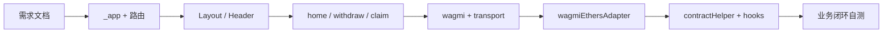
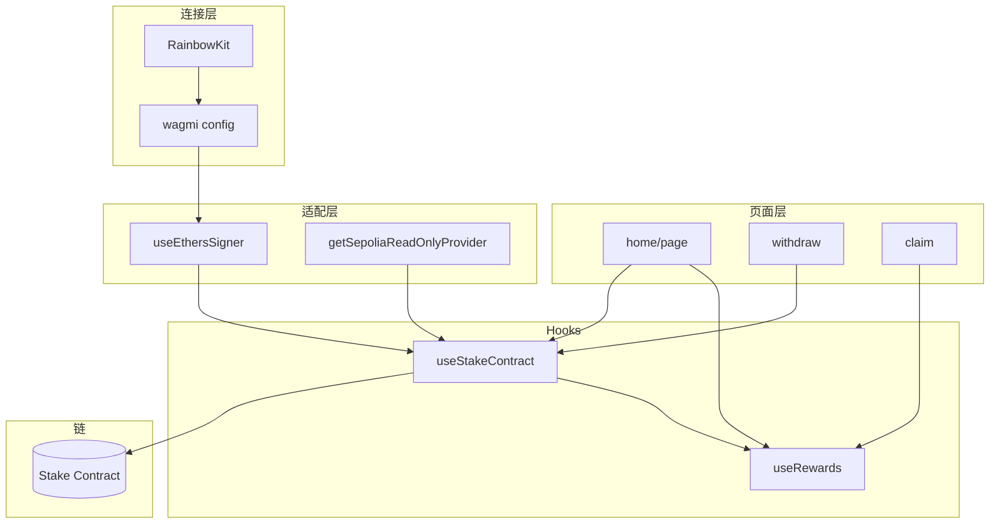

# MetaNode Stake 前端（stake-fe）架构与代码导读

> 路径：`stake-fe/docs/前端架构与代码导读.md`  
> 配套：`stake-fe/需求文档与核心业务逻辑.md`（产品做什么）、`src/` 内各文件中文块注释（为什么这样写）。  
> ABI 大文件 `src/assets/abis/stake.ts` 仅在文件头说明，不逐行注释。

本文面向 **第一次打开本仓库的前端新手**：告诉你 **从哪个文件开始**、**每个文件干什么**、**读完应掌握什么**、**下一步该看哪一个**。按文末「学习路线」顺序阅读即可串起全项目。

---

## 一、5 分钟建立全局印象

### 1.1 这个项目做什么

在 **Sepolia 测试网** 上连接钱包，对质押合约进行：

| 页面 | 路径 | 用户操作 |
|------|------|----------|
| 质押 | `/` | 存入 ETH 或 ERC20，首页也可领取奖励 |
| 解质押 / 提取 | `/withdraw` | `unstake` 申请解锁 → 等待后 `withdraw` 提到钱包 |
| 领取奖励 | `/claim` | `claim` 领取 MetaNode 代币奖励 |

### 1.2 技术分工（先记这一句）

**wagmi + RainbowKit 管「连钱包、账户、链、余额」**；**ethers v6 管「合约读写的 API 与 `tx.wait()`」**；**viem 主要作为 wagmi 底层 RPC**，业务代码不直接 `getContract`。

### 1.3 目录一眼图

```
stake-fe/
├── docs/                          ← 你正在读的导读
├── 需求文档与核心业务逻辑.md        ← 产品需求与合约字段说明（建议第 0 步）
├── package.json                   ← 依赖与 npm scripts
├── .env / .env.local              ← NEXT_PUBLIC_* 环境变量（勿提交私钥）
├── next.config.js / tailwind.config.js
└── src/
    ├── pages/                     ← Next.js 路由（URL 入口）
    ├── components/                ← 布局、顶栏、通用 UI
    ├── hooks/                     ← 合约实例、链上数据聚合
    ├── utils/                     ← wagmi 配置、ethers 适配、RPC、常量
    ├── types/                     ← TypeScript 类型
    ├── assets/abis/               ← 质押合约 ABI
    └── styles/                    ← 全局样式
```

### 1.4 本地跑起来（动手验证）

```bash
cd stake-fe
# 配置 .env.local：NEXT_PUBLIC_STAKE_ADDRESS=你的合约地址
npm install
npm run dev
# 浏览器打开 http://localhost:3000
```

钱包需切到 **Sepolia**，且 `.env` 里质押合约地址正确，否则读链/交易会失败。

---

## 二、推荐学习路线（按阶段，带「下一步」）

每一阶段格式：**阅读文件 → 要掌握什么 → 下一步**。

### 阶段 0：弄清「要做什么」（约 15 分钟）

| 阅读 | 要掌握什么 | 下一步 |
|------|------------|--------|
| `需求文档与核心业务逻辑.md` | 三个页面职责；合约方法名：`depositETH`、`stakingBalance`、`withdrawAmount`、`claim` 等 | 阶段 1 |

---

### 阶段 1：应用从哪启动、页面怎么挂上（约 30 分钟）

| 顺序 | 阅读文件 | 要掌握什么 | 下一步 |
|:----:|----------|------------|--------|
| 1 | `src/pages/_app.tsx` | Next.js **Pages Router** 的全局壳；Provider 嵌套顺序：`ThemeProvider` → `WagmiProvider` → `QueryClientProvider` → `RainbowKitProvider` → `Layout` → 当前页 | 2 |
| 2 | `src/pages/index.tsx` | `/` 路由只 **转发** 到 `home/page`，不把业务写死在 index | 3 |
| 3 | `src/components/Layout.tsx` | 全站背景、顶栏、`main` 插槽、页脚；为何在 `_app` 包一层而不是每页重复 | 4 |
| 4 | `src/components/Header.tsx` | 导航三条链路与 URL 对应；`ConnectButton` 来自 RainbowKit | 5 |
| 5 | `src/styles/globals.css` + `tailwind.config.js` | 视觉基调（Tailwind + 少量全局 class） | 阶段 2 |

**本阶段过关标准**：能画出「打开 `/` 时，React 组件树从 `_app` 到首页」的层级；知道改顶栏/全局 Toast 该改哪个文件。

---

### 阶段 2：三个业务页面（约 1～2 小时）

| 顺序 | 阅读文件 | 要掌握什么 | 下一步 |
|:----:|----------|------------|--------|
| 6 | `src/pages/home/page.tsx` | **质押主流程**：`useStakeContract`、`useRewards`、`useEthersSigner`；ETH 池 `depositETH` vs ERC20 池 `approve` + `deposit`；`tx.wait()` 与 `refresh` | 7 |
| 7 | `src/pages/withdraw/index.tsx` | **两阶段提现**：`unstake` → 等待 → `withdraw`；`withdrawAmount` 拆成「处理中 / 可提取」 | 8 |
| 8 | `src/pages/claim/index.tsx` | 独立领取页；与首页 `claim` 逻辑同源，共用 `useRewards` | 阶段 3 |

**本阶段过关标准**：能口述「用户点质押按钮后，代码依次调了哪些 hook、哪些合约方法」；知道写交易前必须判断 `signer` 非空。

---

### 阶段 3：链与钱包基础设施（约 1 小时）

| 顺序 | 阅读文件 | 要掌握什么 | 下一步 |
|:----:|----------|------------|--------|
| 9 | `src/utils/wagmi.ts` | 只支持 **Sepolia**；`getDefaultConfig`；`sepoliaTransport` 挂到哪条链 | 10 |
| 10 | `src/utils/sepoliaTransport.ts` | viem `fallback` + 多 RPC；与 Infura 环境变量的关系 | 11 |
| 11 | `src/utils/wagmiEthersAdapter.ts` | **`useConnectorClient` → Signer（写）** vs **`useClient` → Provider（读）**；切链时传 `chainId` | 12 |
| 12 | `src/utils/ethersReadProvider.ts` | **断连时** 只读 `FallbackProvider`；与 wagmi client 的区别 | 阶段 4 |

**本阶段过关标准**：能解释「为什么不能拿只读 Provider 发交易」；知道 WalletConnect 的 `projectId` 在 `wagmi.ts` 里，不是 Infura Key。

---

### 阶段 4：合约实例与数据层（约 1 小时）

| 顺序 | 阅读文件 | 要掌握什么 | 下一步 |
|:----:|----------|------------|--------|
| 13 | `src/utils/env.ts` + `src/utils/index.ts` | `NEXT_PUBLIC_STAKE_ADDRESS`；业务常量 **`Pid = 0`**（操作 0 号池） | 14 |
| 14 | `src/utils/contractHelper.ts` | `createEthersContract(address, abi, runner)`；**Signer 可读写，Provider 只读** | 15 |
| 15 | `src/hooks/useContract.ts` | `runner = signer ?? readOnly`；`useStakeContract` / `useTokenContract` | 16 |
| 16 | `src/types/ethersStake.ts` + `src/utils/stakeContractConnect.ts` | 为何需要 `stakeWithSigner`（`connect` 后类型收窄） | 17 |
| 17 | `src/hooks/useRewards.ts` | 聚合 `pool` / `user` / `stakingBalance` / `MetaNode`；60s 轮询；`refresh()` | 18 |
| 18 | `src/assets/abis/stake.ts`（仅文件头） | ABI 从哪来、合约升级后要换什么 | 阶段 5 |

**本阶段过关标准**：能独立写一段「连接钱包 → `useStakeContract` → 只读 `pool(Pid)`」的心智模型；知道 ERC20 池子还要 `useTokenContract`。

---

### 阶段 5：边角与打磨（按需）

| 阅读文件 | 要掌握什么 |
|----------|------------|
| `src/components/ui/Button.tsx` 等 | 复用 UI；`cn.ts` 合并 className |
| `src/utils/retry.ts` | RPC 偶发失败时的重试 |
| `src/utils/metamask.ts` | 把 MetaNode 代币加到 MetaMask |
| `src/utils/theme.ts` | MUI 主题（本项目 UI 以 Tailwind 为主） |
| `next.config.js` | 构建相关配置 |

**全部读完之后**：对照 `需求文档与核心业务逻辑.md` 走一遍「连接 → 质押 → 解质押 → 提取 → 领取」真机流程。

---

## 三、学习路线总览（流程图）



---

## 四、逐文件说明（查表用）

### 4.1 路由与页面 `src/pages/`

| 文件 | URL | 干什么 | 建议掌握 |
|------|-----|--------|----------|
| `_app.tsx` | （无） | 全局 Provider、Toast、包 `Layout` | Provider 顺序、为何只需一个 `QueryClient` |
| `index.tsx` | `/` | 渲染 `home/page` | Pages Router 文件即路由 |
| `home/page.tsx` | （被 index 引用） | 质押 + 同页领奖 | ETH/ERC20 分支、`parseUnits`、`stakeWithSigner` |
| `withdraw/index.tsx` | `/withdraw` | 解质押与提取 | `unstake` / `withdraw` 两阶段语义 |
| `claim/index.tsx` | `/claim` | 仅领取奖励 | 与 `useRewards` 复用 |

> `home/page.tsx` **不会**单独变成 `/home` 路由，只有被 `index.tsx` import 才出现在 `/`。

### 4.2 组件 `src/components/`

| 文件 | 干什么 | 建议掌握 |
|------|--------|----------|
| `Layout.tsx` | 全站壳、背景、footer | 与 `_app` 的分工 |
| `Header.tsx` | Logo、三 Tab、`ConnectButton` | `'use client'` 的原因 |
| `ui/Button.tsx` | 按钮样式封装 | 业务页如何组合 Tailwind |
| `ui/Input.tsx` | 输入框 | 与金额校验配合 |
| `ui/Card.tsx` | 卡片容器 | 布局复用 |

### 4.3 Hooks `src/hooks/`

| 文件 | 干什么 | 建议掌握 |
|------|--------|----------|
| `useContract.ts` | 按链/地址/ABI 创建 ethers `Contract` | `runner` 选型、切链重建实例 |
| `useRewards.ts` | 池子与用户奖励只读数据 | 何时 `isConnected` 才拉数、`refresh` 触发点 |

### 4.4 工具 `src/utils/`

| 文件 | 干什么 | 建议掌握 |
|------|--------|----------|
| `wagmi.ts` | wagmi + RainbowKit 全局 `config` | 链列表、transport、SSR |
| `sepoliaTransport.ts` | Sepolia 多节点 viem transport | fallback 行为 |
| `wagmiEthersAdapter.ts` | viem Client → ethers Provider/Signer | **写交易必读** |
| `ethersReadProvider.ts` | 断连 HTTP 只读 Provider | 与 `useStakeContract` fallback |
| `contractHelper.ts` | `new Contract(..., runner)` 工厂 | ContractRunner 含义 |
| `stakeContractConnect.ts` | `stakeWithSigner` / `erc20WithSigner` | TypeScript 窄化 |
| `env.ts` | 质押合约地址 | `ZeroAddress` 的危害 |
| `index.ts` | `Pid` 等业务常量 | 多池扩展时改哪里 |
| `cn.ts` | `clsx` + `tailwind-merge` | className 合并 |
| `retry.ts` | 延迟重试 RPC | 读链稳定性 |
| `metamask.ts` | `wallet_watchAsset` | 可选体验 |
| `theme.ts` | MUI `createTheme` | 与 Tailwind 并存 |

### 4.5 类型、ABI、样式

| 文件 | 干什么 | 建议掌握 |
|------|--------|----------|
| `types/ethersStake.ts` | 合约方法 TypeScript 签名 | 与 `stakeAbi` 一致 |
| `types/global.d.ts` | 全局类型补充 | 按需查阅 |
| `assets/abis/stake.ts` | 完整 stake ABI JSON | 不手改内部，用工具重新生成 |
| `styles/globals.css` | 全局 CSS、Tailwind 入口 | 与 `Home.module.css`（若使用） |

### 4.6 根目录配置

| 文件 | 干什么 |
|------|--------|
| `package.json` | 依赖版本；`dev` / `build` / `start` |
| `tsconfig.json` | TS 路径与严格度 |
| `next.config.js` | Next 构建选项 |
| `postcss.config.js` / `tailwind.config.js` | 样式流水线 |

---

## 五、架构：数据怎么流

### 5.1 分层简图



### 5.2 读链 vs 写链

| 场景 | 用的对象 | 典型 API |
|------|----------|----------|
| 已连接 · 读 | Signer 上的 provider 或 Contract（runner=Signer） | `stakeContract.pool(Pid)` |
| 已连接 · 写 | `useEthersSigner()` → `stakeWithSigner(contract, signer)` | `depositETH({ value })` → `tx.wait()` |
| 未连接 · 读（可选） | `getSepoliaReadOnlyProvider()` 作 runner | 仅 `eth_call`；**不能**发交易 |
| 用户数据展示 | `useRewards` 内要求 `isConnected` | 与「断连读池子」策略可分别调整 |

### 5.3 一笔 ETH 质押在代码里的步骤

1. 用户输入金额 → `parseUnits(amount, decimals)`  
2. `stakeWithSigner(stakeContract, signer).depositETH({ value: amountWei })`  
3. `const receipt = await tx.wait()`，`receipt?.status === 1` 为成功  
4. `refresh()` / `refetchBalance()` 更新 UI  

ERC20 池：先 `erc20WithSigner(...).approve(质押合约, amount)`，再 `deposit(Pid, amount)`，每步均可 `wait()`。

---

## 六、技术栈对照（深入时查阅）

| 技术 | 在本项目中的角色 |
|------|------------------|
| **Next.js（Pages Router）** | `src/pages/*` 即路由；`_app.tsx` 包裹所有页 |
| **React** | 组件、`useState`、`useEffect`、`useMemo`、`useCallback` |
| **wagmi** | `useAccount`、`useChainId`、`useBalance`、`useConnectorClient` |
| **RainbowKit** | `ConnectButton`、钱包选择 UI |
| **ethers v6** | `Contract`、`parseUnits` / `formatUnits`、`tx.wait()` |
| **viem** | wagmi 底层 transport（`sepoliaTransport`） |
| **TanStack Query** | wagmi v2 缓存；必须在 `WagmiProvider` 内 |
| **Tailwind + Framer Motion** | 主要样式与动效 |
| **MUI ThemeProvider** | 少量 MUI 主题，非主 UI 体系 |
| **react-toastify** | 全局操作反馈 |

---

## 七、环境变量

| 变量 | 作用 |
|------|------|
| `NEXT_PUBLIC_STAKE_ADDRESS` | 质押合约地址；未设置时 `env.ts` 为 `ZeroAddress`，调用会失败 |
| `NEXT_PUBLIC_INFURA_API_KEY` | 可选；拼接 Infura Sepolia URL（见 `sepoliaTransport.ts`、`ethersReadProvider.ts`） |

以 `NEXT_PUBLIC_` 开头会打进浏览器 bundle，**不要放助记词或私钥**。

---

## 八、常见问题（新手）

**Q：为什么同时装 viem 和 ethers？**  
A：wagmi v2 基于 viem；业务合约层选用 ethers 时通过 `wagmiEthersAdapter.ts` 桥接，两套并存是刻意选型。

**Q：`.connect(signer)` 不够吗，为什么还要 `stakeWithSigner`？**  
A：ethers 的 `connect` 返回 `BaseContract`，会丢失自定义方法名；窄化类型避免满屏 `as any`。

**Q：断连时能读池子吗？**  
A：`useStakeContract` 在无 Signer 时用只读 Provider 作 runner；但 `useRewards` 仍要求 `isConnected` 才拉用户相关数据（与改前产品行为一致）。

**Q：交易不弹窗就失败？**  
A：查 RPC、网络、Sepolia 余额；看控制台与 toast；合约 revert 需结合 Etherscan / 合约逻辑。

**Q：切链后数据不对？**  
A：确保 `useEthersSigner({ chainId })` 与 `useChainId()` 一致，且 `useMemo` 依赖 `signer` / `chainId`。

---

## 九、排查清单

- 合约地址为零 → 检查 `NEXT_PUBLIC_STAKE_ADDRESS`  
- 读不到数据 → 钱包是否 Sepolia、RPC 是否限流（已配 fallback）  
- 写交易失败 → `signer` 是否为空、余额/授权是否足够  
- 类型报错 → 是否应对 `stakeWithSigner` 后再调业务方法  

---

## 十、与源码注释的关系

- 本文：全项目 **阅读顺序** 与 **文件索引**。  
- `src/`：**已逐行/逐段补充中文注释**（说明做什么、原理、为何这样写）。  
  - **逻辑与链交互**（`utils/`、`hooks/`、三个业务页的 `handleStake` 等）：注释最密。  
  - **纯展示 JSX**（Tailwind className）：用块注释说明区域职责，避免每行 class 重复解释。  
  - **`assets/abis/stake.ts`**：仅文件头说明（ABI 体积过大，不逐行注释）。  
- `需求文档与核心业务逻辑.md`：**做什么、合约字段含义**。  

三者配合：先需求 → 再按本文阶段读代码 → 对照文件内注释理解每一行。

---

## 十一、历史说明

- 原 `src/utils/viem.ts`（viem `getContract` 专用）已移除；断连公开读由 `ethersReadProvider.ts` 承担，已连接读写由 Signer 绑定的 Contract 承担。

---

*文档版本与仓库实现一致；若你新增页面或改用 App Router，请同步更新「阶段 1」路由表与第四节文件清单。*
