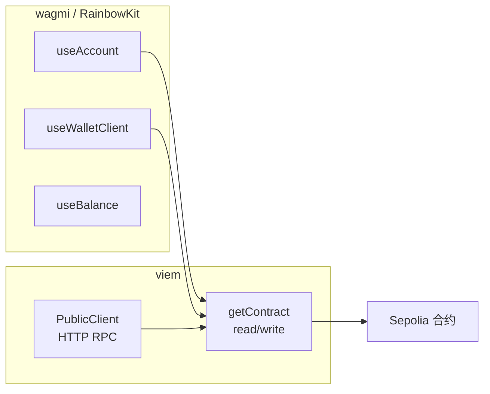

# MetaNode Stake 前端（stake-fe）架构与代码导读

> **文件路径**：`stake-fe/docs/前端架构与代码导读.md`  
> **当前分支（main）技术栈**：**wagmi v2 + viem + RainbowKit + TanStack Query**，**不是**自研 `Web3Provider` / 纯 ethers 方案。  
> **配套**：`src/` 里许多文件已有**中文块注释**，和本文一起读；[`assets/abis/stake.ts`](../src/assets/abis/stake.ts) 为生成的大 ABI，**只读文件头即可**。

---

## 这篇文档适合谁？怎么用？

- 适合：**刚接触 DApp**，想按顺序读懂「连接钱包 → 读链 → 发交易」在本项目里怎么落地。  
- **建议**：从 **第 0 步**往下读，一天几步即可。每步末尾有「读完你应该能说什么」自检。  
- **本分支没有**：`providers/Web3Provider.tsx`、`formatWalletConnectError`、`injectedProvider`、自研多钱包弹窗等；连接 UI 以 **RainbowKit `ConnectButton`** 为主。

---

## 第 0 步：先搞懂几个词（不懂这些后面会晕）

| 词 | 傻瓜理解 | 在本项目里 |
|----|----------|------------|
| **Sepolia** | 以太坊**测试网**，gas 用测试 ETH。 | `wagmi.ts` 里 `chains: [sepolia]`，与 `viem/chains` 的 `sepolia` 一致。 |
| **wagmi** | React 专用钩子库：`useAccount`、`useWalletClient`、`useBalance`… 把「钱包状态」变成组件里可用的数据。 | 包裹在 `_app.tsx` 的 `WagmiProvider` 里。 |
| **viem** | 偏底层的 TS 库：编解码、`getContract`、`parseUnits`、`waitForTransactionReceipt`。 | [`contractHelper.ts`](../src/utils/contractHelper.ts)、页面发交易与等待回执。 |
| **RainbowKit** | 现成的「连接钱包」按钮与弹窗；内部用 wagmi。 | [`Header.tsx`](../src/components/Header.tsx)、首页等处的 `ConnectButton`。 |
| **TanStack Query（React Query）** | 做请求缓存、重试、去重。wagmi v2 **依赖**它。 | `_app.tsx` 里 `QueryClientProvider`，与 `WagmiProvider` 嵌套。 |
| **PublicClient（viem）** | 通过 **HTTP RPC** 读链、模拟交易，**不能**替你签名。 | [`viem.ts`](../src/utils/viem.ts) `createPublicClient`。 |
| **WalletClient（viem）** | 来自用户钱包，可 **`write`**（签名并发交易）。 | `useWalletClient()` 的 `data`。 |
| **ABI** | 合约有哪些函数的「说明书」。 | [`stake.ts`](../src/assets/abis/stake.ts)。 |
| **read / write（viem 合约对象）** | `contract.read.xxx()` 只读；`contract.write.xxx()` 要走钱包签名。 | [`contractHelper.ts`](../src/utils/contractHelper.ts) 把 public + wallet 绑在一起。 |

**一句话记本分支**：**wagmi 管连接和 React 状态**，**viem 管怎么和链说话**；读多用 **PublicClient（HTTP）**，写用 **WalletClient（钱包）**。

---

## 第 1 步：应用从哪启动？（`_app.tsx`）

### 1.1 读哪个文件？

[`src/pages/_app.tsx`](../src/pages/_app.tsx)

### 1.2 它在干什么？

Next.js 每个页面渲染前都会先经过这里。嵌套顺序（**从外到内**）：

1. **ThemeProvider（MUI）** — 若用 MUI 组件，消费主题。  
2. **WagmiProvider** — 注入 `config`（链、RPC transport）。  
3. **QueryClientProvider** — wagmi v2 需要；缓存链上相关请求。  
4. **RainbowKitProvider** — 连接钱包 UI；依赖 wagmi 上下文，必须在 Wagmi **内部**。  
5. **ToastContainer** — 全局提示。  
6. **Layout** — 顶栏 + 页脚；中间 `children` 是当前路由页面。

并引入：全局 CSS、**RainbowKit 自带样式** `@rainbow-me/rainbowkit/styles.css`。

### 1.3 为什么要这个顺序？

- 用了 `useAccount` / `useWalletClient` 的组件必须是 `WagmiProvider` 的后代。  
- 官方示例要求 **QueryClient 在 Wagmi 内层**（与当前版本对齐）。  
- RainbowKit 的 `ConnectButton` 需要 **RainbowKitProvider + wagmi**。

### 1.4 读完你应该能说什么？

「`_app` 里最外层是 MUI，往里是 wagmi → React Query → RainbowKit，再是布局和页面。」

---

## 第 2 步：wagmi 全局配置从哪来？（`wagmi.ts`）

### 2.1 读哪个文件？

[`src/utils/wagmi.ts`](../src/utils/wagmi.ts)

### 2.2 它在干什么？

- 调用 RainbowKit 封装的 **`getDefaultConfig`**：应用名、**WalletConnect `projectId`**、**只启用 Sepolia 一条链**、每条链的 **transports**（RPC）。  
- **`ssr: true`**：Next 会先服务端渲染一版 HTML，避免在服务端错误访问 `window`。  
- 导出 **`defaultChainId`**，与 `contractHelper` 默认链一致。

### 2.3 原理：`projectId` 是什么？

不是 Infura Key。用于 **WalletConnect v2**（例如移动端扫码连钱包）。在 Cloud.walletconnect.com 创建项目可得。

### 2.4 读完你应该能说什么？

「链和 RPC 入口在 `wagmi.ts`；`projectId` 给 WalletConnect 用。」

---

## 第 3 步：RPC 为什么能「失败再试」？（`sepoliaTransport.ts`）

### 3.1 读哪个文件？

[`src/utils/sepoliaTransport.ts`](../src/utils/sepoliaTransport.ts)

### 3.2 它在干什么？

用 viem 的 **`fallback([http(...), http(...), ...])`**：前一个 URL 报错或超时则试下一个。

### 3.3 为什么要 fallback？

公共 RPC 常限流；**读**和 **写之前的模拟/估算** 都会打这些 URL，单点挂了页面容易「还没弹钱包就失败」。

### 3.4 环境变量

- **`NEXT_PUBLIC_INFURA_API_KEY`**：可选；有则用自己的 Infura URL。  
- 文档注释提醒：这是 **项目 ID 类配置**，不是链上私钥。

### 3.5 读完你应该能说什么？

「`sepoliaTransport` 被 wagmi 和 `createPublicClient` 共用，减少「读用 A、模拟用 B」不一致。」

---

## 第 4 步：只读客户端 PublicClient（`viem.ts`）

### 4.1 读哪个文件？

[`src/utils/viem.ts`](../src/utils/viem.ts)

### 4.2 它在干什么？

按 `chainId`（当前只有 Sepolia）返回 **`createPublicClient({ chain: sepolia, transport: sepoliaTransport })`**。

### 4.3 为什么要单独文件？

`contractHelper` 里所有 **`read`** 和部分 **`write` 前置步骤**都依赖这个 **HTTP** 客户端；与 wagmi 的 wallet 分离，职责清晰。

### 4.4 参数名 `chaiId`

源码里故意保留拼写 `chaiId`，注释说明为避免大范围改名；**语义就是 chainId**。

### 4.5 读完你应该能说什么？

「浏览器里没有用户私钥时，读链主要靠 `PublicClient` + RPC。」

---

## 第 5 步：合约实例怎么造？（`contractHelper.ts` — 核心）

### 5.1 读哪个文件？

[`src/utils/contractHelper.ts`](../src/utils/contractHelper.ts)

### 5.2 双客户端模型（必须理解）

`viem` 的 `getContract` 传入：

```ts
client: {
  public: viemClients(chainId),  // HTTP：read、模拟、估算
  wallet: signer,                // 钱包：write（未连接时可为 undefined）
}
```

- **未连接钱包**：仍可能构造合约对象，但 **`write` 不可用**；本项目业务多在连接后才操作。  
- **写交易也会受 public RPC 影响**：viem 发交易前常做 **simulate / estimate**，会走 **public** 那条 RPC。

### 5.3 读完你应该能说什么？

「`read` 主要走 public；`write` 走 wallet，但 public 挂了可能连弹窗都到不了。」

---

## 第 6 步：React 里怎么拿合约？（`useContract.ts`）

### 6.1 读哪个文件？

[`src/hooks/useContract.ts`](../src/hooks/useContract.ts)

### 6.2 它在干什么？

- **`useWalletClient()`**：连接后才有 `walletClient`。  
- **`useChainId()`**：用户切链后更新，**`useMemo` 依赖它**，避免用旧链的 client 发交易。  
- **`useStakeContract` / `useTokenContract`**：封装质押 ABI + 地址（或动态 token 地址）。

### 6.3 为什么要 `useMemo`？

`walletClient` 或 `chainId` 一变，合约实例要重建，否则会用到**过期引用**。

### 6.4 读完你应该能说什么？

「页面里先 `useStakeContract()`，再 `.read` / `.write`。」

---

## 第 7 步：聚合读数据（`useRewards.ts`）

### 7.1 读哪个文件？

[`src/hooks/useRewards.ts`](../src/hooks/useRewards.ts)

### 7.2 它在干什么？

- 用 **`useAccount()`** 判断 `address`、`isConnected`。  
- 调 `stakeContract.read.pool` / `user` / `stakingBalance` / `MetaNode` 等，**格式化**成字符串给 UI。  
- **`retryWithDelay`** 包一层，缓解 RPC 偶发失败。  
- 定时刷新 + 对外暴露 **`refresh()`** 供交易成功后手动拉新。

### 7.3 读完你应该能说什么？

「首页和 Claim 页共享 `useRewards`，减少重复读合约代码。」

---

## 第 8 步：页面里发交易的标准姿势

### 8.1 读哪个文件（示例最全）？

[`src/pages/home/page.tsx`](../src/pages/home/page.tsx)

### 8.2 模式

1. **`useStakeContract()`**、**`useWalletClient()`** — 有 `walletClient` 才能 `write`。  
2. **`useBalance`**（wagmi）— 展示与校验余额、decimals。  
3. **ETH 池**：`stakeContract.write.depositETH([], { value: amountWei })` → 返回 **hash**。  
4. **`waitForTransactionReceipt(walletClient, { hash })`**（viem/actions）— 等到 **`status === 'success'`**。  
5. **`refetchBalance` / `refresh()`** — 更新界面。

ERC20 池：**`approve` → 等 receipt → `deposit` → 等 receipt**。

### 8.3 为什么用 `waitForTransactionReceipt` 而不是自己轮询？

viem 提供的标准写法，与 WalletClient 配合；等价于「等这笔交易上链确认」。

### 8.4 读完你应该能说什么？

「`write` 返回 hash；要 `waitForTransactionReceipt` 再 toast 成功。」

---

## 第 9 步：其它页面

| 文件 | 路径 | 要点 |
|------|------|------|
| [`pages/index.tsx`](../src/pages/index.tsx) | `/` | 极薄，渲染 `home/page`。 |
| [`pages/withdraw/index.tsx`](../src/pages/withdraw/index.tsx) | `/withdraw` | `unstake` + 到期 `withdraw`；读 `withdrawAmount` 等。 |
| [`pages/claim/index.tsx`](../src/pages/claim/index.tsx) | `/claim` | `write.claim([Pid])` + 等 receipt + `refresh`。 |

### 9.1 顶栏连接

[`components/Header.tsx`](../src/components/Header.tsx) 使用 **`ConnectButton`**，未使用自研 `WalletConnectPrompt`。

---

## 第 10 步：小工具与类型（遇到再查）

| 文件 | 作用 |
|------|------|
| [`utils/env.ts`](../src/utils/env.ts) | `NEXT_PUBLIC_STAKE_ADDRESS`，未配则 `zeroAddress`，易失败。 |
| [`utils/index.ts`](../src/utils/index.ts) | **`Pid = 0`**，池子 ID。 |
| [`utils/retry.ts`](../src/utils/retry.ts) | 重试 + 429 指数退避。 |
| [`utils/metamask.ts`](../src/utils/metamask.ts) | `wallet_watchAsset`，把代币加进 MetaMask 展示。 |
| [`utils/cn.ts`](../src/utils/cn.ts) | Tailwind 类名合并。 |
| [`utils/theme.ts`](../src/utils/theme.ts) | MUI 主题。 |
| [`types/global.d.ts`](../src/types/global.d.ts) | `window.ethereum` 类型（给 `metamask.ts` 等用）。 |

**说明**：当前 **main** 下**没有** `src/config/chain.ts`；链常量来自 **`wagmi/chains`** 与 **`viem/chains`** 的 `sepolia`。

---

## `src` 目录地图（与 main 分支一致）

```
src/
├── pages/
│   ├── _app.tsx              # Wagmi + Query + RainbowKit + Layout
│   ├── index.tsx             # "/" → home/page
│   ├── home/page.tsx         # 质押 + 同页 claim
│   ├── withdraw/index.tsx
│   └── claim/index.tsx
├── components/
│   ├── Layout.tsx
│   ├── Header.tsx            # ConnectButton（RainbowKit）
│   └── ui/                   # Button, Card, Input
├── hooks/
│   ├── useContract.ts        # viem getContract + wagmi wallet/chainId
│   └── useRewards.ts         # 读 pool / user / 奖励
├── utils/
│   ├── wagmi.ts              # getDefaultConfig
│   ├── sepoliaTransport.ts   # fallback RPC
│   ├── viem.ts               # PublicClient
│   ├── contractHelper.ts     # public + wallet 双客户端
│   ├── env.ts, index.ts, retry.ts, metamask.ts, cn.ts, theme.ts
├── assets/abis/
│   └── stake.ts              # 大 ABI，读头注释即可
├── styles/
│   └── globals.css           # Tailwind + 组件类
└── types/
    └── global.d.ts
```

### 仓库根目录（配置与静态资源）

```
stake-fe/
├── package.json          # wagmi / viem / @rainbow-me/rainbowkit / @tanstack/react-query
├── next.config.js
├── tsconfig.json
├── tailwind.config.js
├── postcss.config.js
├── public/               # 静态资源；如 favicon.ico
└── src/                  # 见上
```

---

## 第 11 步：样式与静态资源（`styles` / `public`）

### 11.1 [`src/styles/globals.css`](../src/styles/globals.css)

- `@tailwind` 三层指令；`body` 背景。  
- **组件类**：`.btn-primary`、`.card`、`.tech-grid` 等，页面里直接写 class 名。

### 11.2 Tailwind 构建链

`postcss.config.js` → `tailwindcss` + `autoprefixer`；**`tailwind.config.js` 的 `content`** 必须包含你写 class 的 `src/pages`、`src/components` 路径，否则样式不生成。

### 11.3 `public/`

`_app` 里 `<link href="/favicon.ico" />` 对应 **`public/favicon.ico`**；图片等用 `/xxx` 引用，**不要**带 `public` 前缀。

### 11.4 读完你应该能说什么？

「全局样式从 `globals.css` 进；RainbowKit 另有独立 CSS 在 `_app` import。」

---

## 第 12 步：Next / 脚本（傻瓜版）

| 命令 | 含义 |
|------|------|
| `pnpm dev` | 本地开发，默认 localhost:3000 |
| `pnpm build` / `pnpm start` | 构建与生产启动 |

[`next.config.js`](../next.config.js) 当前较简（如 `reactStrictMode`）；复杂需求再往里加。

---

## 核心数据流一图（复习）



---

## 环境变量与安全

| 变量 | 作用 |
|------|------|
| `NEXT_PUBLIC_STAKE_ADDRESS` | 质押合约地址 |
| `NEXT_PUBLIC_INFURA_API_KEY` | 可选，改善 RPC |

**切勿**把私钥写进 `NEXT_PUBLIC_*` 或前端代码。

---

## 常见排查

| 现象 | 优先想 |
|------|--------|
| 交易没弹钱包就失败 | **public RPC** 模拟/估算失败；检查 `sepoliaTransport`、网络、限流 |
| 连接按钮异常 | WalletConnect `projectId`、浏览器扩展、RainbowKit 版本 |
| 合约 revert | 链上逻辑；Etherscan 看回执 |
| 地址全零 | `NEXT_PUBLIC_STAKE_ADDRESS` 未配置 |

---

## 与「纯 ethers / 自研 Web3Provider」分支的差异（了解即可）

另一套实现可能使用 **`BrowserProvider` + `FallbackProvider` + 自研连接与错误文案**。  
**当前 main** 用 **wagmi 管理连接状态** + **viem 合约与 RPC**，**ABI 与业务页面流程可对照学习**，但底层 API 名称不同（`read`/`write` vs ethers `Contract` 方法等）。

若迁移到 ethers：可用 wagmi 的 ethers 适配器把 **Signer** 交给 ethers `Contract`，或完全自管 `window.ethereum`；**`Pid`、地址、页面分层**仍建议保持。

---

## 学习检查清单

- [ ] 能画出 `_app.tsx` 里 Provider 从外到内的顺序。  
- [ ] 能解释 **public** 与 **wallet** 在 `contractHelper` 里的分工。  
- [ ] 能说出 ETH 质押从 `write` 到 `waitForTransactionReceipt` 的步骤。  
- [ ] 知道 `wagmi.ts` 与 `sepoliaTransport.ts`、`viem.ts` 各管什么。  
- [ ] 知道 `Pid`、质押合约地址在哪里配置。  

---

**祝你学习顺利。** 建议对照源码文件头注释，从 `_app.tsx` → `wagmi.ts` → `contractHelper.ts` → `useContract.ts` → `home/page.tsx` 走一遍，印象最深。
