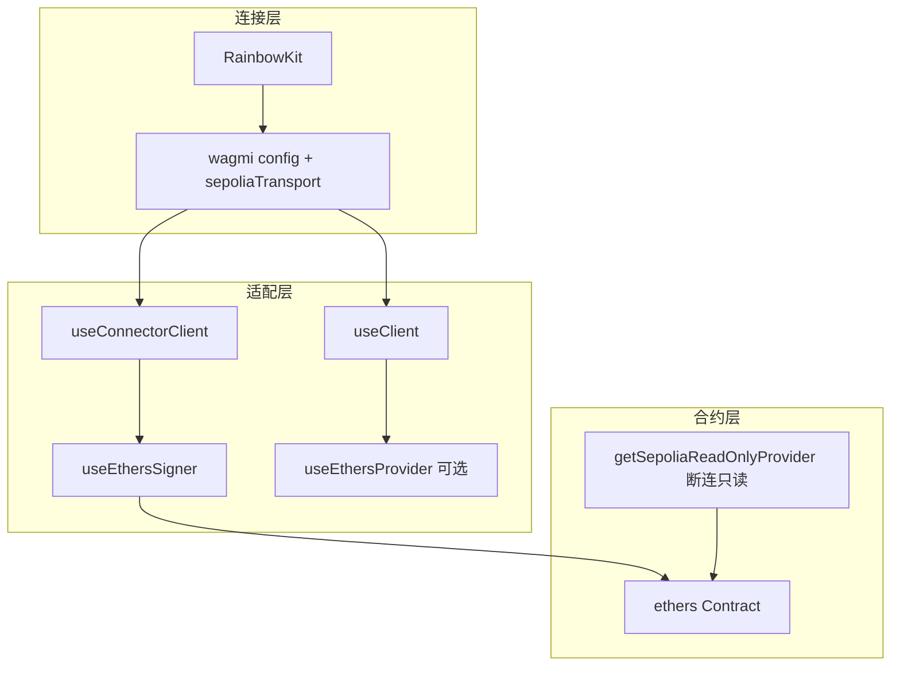

# MetaNode Stake 前端（stake-fe）架构与代码导读

> 文件路径：`stake-fe/docs/前端架构与代码导读.md`  
> 各源码文件内另有 **中文块注释**，与本篇互为补充（ABI 大文件仅在文件头说明）。

本文说明本仓库 **如何组织页面、如何连钱包、如何读链与发交易**。当前实现为 **wagmi + RainbowKit 负责连接**，**ethers v6 负责合约实例与交易**，**viem 仍随 wagmi 存在（双栈）**。

---

## 1. 技术栈各自做什么

| 技术 | 在本项目中的角色 |
|------|------------------|
| **Next.js（Pages Router）** | 路由入口在 `src/pages/`：每个文件/文件夹对应一个 URL，`_app.tsx` 包裹所有页面。 |
| **React** | 组件 + 状态（`useState`）+ 副作用（`useEffect`）。 |
| **wagmi** | React 里用钩子拿「当前链、账户」；和 RainbowKit 一起完成连接钱包；内部仍以 **viem Client** 实现 RPC。 |
| **ethers v6** | **业务合约层**：`Contract`、`parseUnits` / `formatUnits`、发交易后 **`tx.wait()`**；工厂见 `contractHelper.ts`。 |
| **viem** | **不直接写合约读写**；作为 wagmi 的底层类型与 Transport（`sepoliaTransport` 仍用 `viem` 的 `fallback` / `http`）。适配层把 viem `Client` 转成 ethers `Provider` / `Signer`。 |
| **RainbowKit** | 连接钱包 UI（`ConnectButton`）+ 依赖 WalletConnect 的 `projectId`。 |
| **TanStack Query** | wagmi v2 缓存链上请求；必须在 `WagmiProvider` 里包一层 `QueryClientProvider`。 |
| **MUI ThemeProvider** | 仅为主题色/字体；大部分 UI 用 Tailwind。 |

核心思想：**wagmi 管「钱包与 React 状态」**，**ethers 管「合约调用与单位换算」**；viem 在此仓库中主要是 **wagmi 的依赖与 RPC 配置**，不是业务 `getContract` 入口。

---

## 2. 依赖关系（简图）

- **写路径**：`useEthersSigner` → `stakeWithSigner` / `erc20WithSigner` → 合约写方法 → `tx.wait()`。  
- **读路径（已连接）**：`useStakeContract` 的 `runner` 优先为 **Signer**（其上有 `provider`），与 ethers 文档一致。  
- **读路径（未连接）**：`runner` 退化为 **`getSepoliaReadOnlyProvider()`**（与 `sepoliaTransport` 同源的 HTTP fallback），便于与「断连仍展示公开池子数据」类产品行为对齐；若产品不需要断连读，可收窄为仅在有 Signer 时创建合约。

---

## 3. 三种方案对比（历史与选型）

| 维度 | 纯 viem 合约（`getContract` + `read`/`write`） | 纯 ethers 自研 Web3（如仅用 `BrowserProvider`） | **本仓库：wagmi + ethers** |
|------|-----------------------------------------------|--------------------------------------------------|---------------------------|
| 连接与账户 | 可用 wagmi 或手写 `window.ethereum` | 手写监听链/账户切换 | **wagmi + RainbowKit** |
| 合约 API | `read.*` / `write.*`，`waitForTransactionReceipt` | `Contract` + `tx.wait()` | **`Contract` + `tx.wait()`** |
| 与 wagmi 集成 | 原生（同栈 viem） | 需自桥接 | **官方范式：`useConnectorClient` → Signer** |
| node_modules | wagmi + viem | ethers +（可选）wagmi | **wagmi + viem + ethers**（体积最大，迁移最平滑） |

---

## 4. 建议阅读顺序（从根到叶）

1. **`src/pages/_app.tsx`** — 全局壳：Wagmi、React Query、RainbowKit、Toast、布局。  
2. **`src/pages/index.tsx`** — 根路径 `/` 渲染首页。  
3. **`src/components/Layout.tsx`**、`**Header.tsx**` — 壳与导航、`ConnectButton`。  
4. **`src/pages/home/page.tsx`**、`**withdraw/index.tsx**`、`**claim/index.tsx**` — 质押 / 解质押 / 领取；写交易前校验 **`useEthersSigner()`** 非空。  
5. **`src/utils/wagmi.ts`** + **`src/utils/sepoliaTransport.ts`** — 链与多 RPC fallback（viem transport）。  
6. **`src/utils/wagmiEthersAdapter.ts`** — viem Client → ethers Provider / Signer（**必读中文注释**）。  
7. **`src/utils/ethersReadProvider.ts`** — 断连只读 HTTP `FallbackProvider`。  
8. **`src/utils/contractHelper.ts`**、`**src/hooks/useContract.ts**` — `createEthersContract`、`runner = signer ?? readOnly`。  
9. **`src/utils/stakeContractConnect.ts`**、`**src/types/ethersStake.ts**` — `.connect(signer)` 后类型收窄。  
10. **`src/hooks/useRewards.ts`** — `pool` / `user` / `stakingBalance` 等只读聚合。  
11. **`src/utils/env.ts`**、`**src/utils/index.ts**` — 合约地址、`Pid`。

---

## 5. Next.js 路由与 URL

使用 **Pages Router**：

| 文件路径 | 浏览器路径 |
|----------|------------|
| `pages/index.tsx` | `/` |
| `pages/withdraw/index.tsx` | `/withdraw` |
| `pages/claim/index.tsx` | `/claim` |
| `pages/_app.tsx` | 不对应 URL，全局包装 |

`pages/home/page.tsx` **不是**独立路由，仅被 `index.tsx` import。

---

## 6. `_app.tsx`：Provider 嵌套顺序

- `WagmiProvider` 必须包住所有使用 `useAccount`、`useChainId`、`useConnectorClient` 的组件。  
- wagmi v2 要求 **`QueryClientProvider` 在 `WagmiProvider` 内部**（与官方文档一致）。  
- `RainbowKitProvider` 依赖 wagmi 上下文。  
- ethers 的 `Contract` 与适配器钩子仅在 **客户端** 使用；页面级组件已用 `'use client'`。

---

## 7. 合约交互：读与写

### 7.1 Signer 与 Provider

- **`useEthersSigner`**：来自 **已连接钱包** 的 `useConnectorClient`，用于 **签名与发交易**。未连接时为 `undefined`。  
- **`useEthersProvider`**（本仓库可选参考）：来自 `useClient`，映射为 JSON-RPC / Fallback **只读** Provider。  
- **`getSepoliaReadOnlyProvider`**：不经过 wagmi，用于 **`useStakeContract` 在断连时的 runner**，与 `sepoliaTransport` 的 URL 列表对齐。

**常见坑**：不要用 `useClient` 转出来的对象当 Signer；不要用只读 Provider 去发交易。

### 7.2 一笔质押在代码里分几步（ETH 池）

1. `stakeWithSigner(stakeContract, signer).depositETH({ value: amountWei })`  
2. `const receipt = await tx.wait()`，`receipt?.status === 1` 表示成功。  
3. `refresh` / `refetchBalance` 更新 UI。

ERC20 池：`erc20WithSigner` 上 **`approve`**，再 **`deposit(Pid, amount)`**，每步均可 `wait()`。

### 7.3 `Pid`

合约支持多池；前端常量 **`Pid = 0`** 表示操作 0 号池。

---

## 8. 环境变量

| 变量 | 作用 |
|------|------|
| `NEXT_PUBLIC_STAKE_ADDRESS` | 质押合约地址；未设置时 `env.ts` 为 `ZeroAddress`，易导致调用失败。 |
| `NEXT_PUBLIC_INFURA_API_KEY` | 可选；拼接 Infura Sepolia URL，见 `sepoliaTransport.ts` 与 `ethersReadProvider.ts`。 |

以 `NEXT_PUBLIC_` 开头会打进浏览器，**不要放私钥**。

---

## 9. FAQ（新手）

**为什么还要装 viem 又装 ethers？**  
wagmi v2 以 viem 为类型与 Client 实现；业务层选用 ethers 时，两者 **并存**。适配代码见 `wagmiEthersAdapter.ts`。

**`.connect(signer)` 后为什么还有 `stakeWithSigner`？**  
ethers 类型定义里 `connect` 返回 **`BaseContract`**，会丢失自定义 ABI 方法名；用窄化类型避免整页 `as any`。

**断连时能读池子吗？**  
当前 `useStakeContract` 在 **无 Signer** 时使用 **`getSepoliaReadOnlyProvider()`**；`useRewards` 仍要求 **`isConnected`** 才拉用户与池子展示逻辑（与改前一致）。若要「完全断连不读链」，可去掉 readOnly fallback 并收窄 hook。

---

## 10. 常见排查思路

- **交易未弹窗就失败**：RPC 模拟/网络错误；已用 fallback，仍失败可换更稳定节点。  
- **合约 revert**：链上逻辑拒绝，需在 Etherscan / 合约侧看原因。  
- **地址为零**：检查 `NEXT_PUBLIC_STAKE_ADDRESS`。  
- **切链后行为异常**：确保 `useEthersSigner({ chainId })` 与 `useChainId()` 一致，且合约实例 `useMemo` 依赖 `signer` / `chainId`。

---

## 11. 源码注释说明

`src/` 下各文件已补充 **中文注释**（`stake.ts` 仅在文件头说明用途）。阅读时对照本文与代码内「为什么这样写」的注释即可。

---

## 12. 已移除的 viem 合约专用文件

- 原 **`src/utils/viem.ts`**（仅服务于 `getContract` 的 `PublicClient`）已删除；公开读在断连场景由 **`ethersReadProvider`** 承担，已连接场景由 **Signer 绑定的 provider** 承担。
